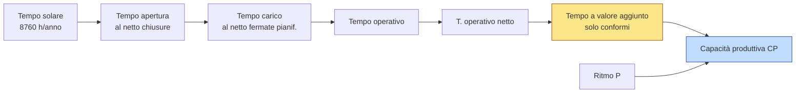

---
aliases:
  - "Capacità Produttiva"
  - "Capacità produttiva"
  - "Capacità produttiva teorica vs reale"
---

---

tags: [impianti, cap3, prestazioni, quantitativo] tipo: atomic-note capitolo: "[[03 Cap3 - Prestazioni dei sistemi di produzione]]" aliases:

- CP
- Capacità produttiva installata
- Capacità produttiva ideale
- Capacità produttiva effettiva
- Capacità produttiva reale

---

# Capacità produttiva

> [!info] Classificazione **Concetto quantitativo** → formula chiusa $CP = P \cdot T_{OVA}$, calcolabile con tre varianti operative.

**In 10 secondi:** la capacità produttiva $CP$ è la **quantità massima** di pezzi che un impianto è in grado di sfornare in un periodo definito (anno, mese…). Si ottiene moltiplicando il **ritmo** $P$ per il **tempo effettivo a valore aggiunto**: $CP = P \cdot T_{OVA}$.

---

## §1 Domanda fondamentale

> Dato un sistema produttivo e un orizzonte temporale (anno, mese, settimana), **quanti pezzi posso garantire** al massimo?

Mentre $P$ ti dice il **ritmo** [pz/tempo], $CP$ traduce quel ritmo in **volume totale** sull'orizzonte richiesto. È il numero che serve per rispondere a domande come "ce la facciamo con quest'ordine?", "quante macchine devo installare?", "regge il piano commerciale dell'anno prossimo?".

---

## §2 Il problema concreto

**MobilArte S.r.l.**, produttore di sedie in legno massello per il canale HoReCa (alberghi, ristoranti, contract). Una linea automatica di assemblaggio + finitura.

Sulla scheda tecnica della linea: **80 sedie/ora** (potenzialità nominale).

Il direttore commerciale rientra entusiasta da un meeting con una catena alberghiera francese:

> «Vogliono **25.000 sedie nei prossimi 6 mesi**. Stimo la linea aperta circa 400 h/mese. Quindi: 80 × 400 × 6 = 192.000 sedie potenziali. Ce la facciamo dieci volte!»

L'ingegnere di produzione, più cauto, guarda i tabulati storici:

- la linea è effettivamente caricata di lavoro per il **90% del tempo** di apertura (il resto: pulizie pianificate, riunioni, mancanza ordini)
- quando è caricata, è **disponibile al 92%** (guasti e set-up rubano l'8%)
- quando produce, marcia al **85%** della velocità di targa (microstop, rallentamenti)
- il **4% dei pezzi** esce difettoso → scarti o rilavorazioni

➡️ **Il dilemma:** il commerciale ha moltiplicato $P_{teorica} \cdot T_{apertura}$. È **realistico**? E se non lo è, qual è la $CP$ vera della linea, e come la calcolo a partire da $P$ senza promettere al cliente quello che la fabbrica non sa fare?

→ La risposta richiede di passare da $P$ a $CP$ tramite il **vero** tempo a valore aggiunto, non quello di apertura.

---

## §3 La definizione

**Capacità produttiva** ($CP$) — quantità **massima** di output che il sistema è in grado di produrre in un **arco temporale prefissato**, a parità di condizioni degli input.

$$CP = P \cdot T_{OVA} \qquad [\text{pezzi}]$$

dove $T_{OVA}$ è il **tempo operativo a valore aggiunto** — l'unico tempo per cui il cliente paga (vedi [[OEE]]).

### Scomposizione in parti

**Per orizzonte temporale.** $CP$ va sempre riferita a un periodo: tipicamente $\text{CP}_{\text{annua}}$, $\text{CP}_{\text{mensile}}$, $\text{CP}_{\text{giornaliera}}$. Cambia il periodo → cambia il numero, anche con la stessa linea.

**Per dimensione di prestazione.** $CP$ può riferirsi a tre cose diverse:

|Tipo|Domanda a cui risponde|
|---|---|
|$CP$ in **volumi**|quanti pezzi totali?|
|$CP$ in **assortimento** (mix)|quanti pezzi di ciascun tipo?|
|$CP$ in **tempo** (consegne)|entro quando può uscire l'ordine?|

**Per condizioni operative — distinzione cruciale.**

|Tipo|Condizioni|A cosa serve|
|---|---|---|
|$CP_{teorica}$ (installata, ideale)|nessuna fermata, nessuno scarto, ritmo nominale|benchmark, dimensionamento ex-novo|
|$CP_{reale}$ (effettiva)|tutte le perdite incluse (OEE realistico)|promesse al cliente, pianificazione|

> [!important] La regola del commerciale Per le **promesse al cliente** si usa **sempre** $CP_{reale}$. Il dato di targa moltiplicato per le ore di apertura è $CP_{teorica}$ — un numero che _l'impianto non vedrà mai_.

---

## §4 Come funziona

**Il cuore in una frase:** $CP$ è il **ritmo** della linea ($P$) "srotolato" sul **tempo davvero produttivo** ($T_{OVA}$) — non quello in cui la linea sta accesa, ma quello in cui sforna pezzi _conformi_.

### Tre formule equivalenti — perché esistono e quale usare

A partire dal "rubinetto" $TOVA$ si può risalire al tempo di apertura o al tempo di carico, intercettando rispettivamente $TEEP$ e $OEE$:

$$CP = P \cdot T_{OVA} = P \cdot T_A \cdot TEEP = P \cdot T_C \cdot OEE$$

Sono **tutte e tre la stessa cosa**, scritte in modi diversi a seconda di quali dati hai in mano:

|Formula|Quando usarla|
|---|---|
|$CP = P \cdot T_{OVA}$|hai direttamente il tempo a valore aggiunto (raro)|
|$CP = P \cdot T_A \cdot TEEP$|parti dal tempo di **apertura** dell'impianto|
|$CP = P \cdot T_C \cdot OEE$|parti dal tempo di **carico** (cioè dopo aver sottratto le fermate pianificate)|

### Cosa accade se...

- **...la domanda è inferiore a $CP_{reale}$?** → l'impianto è **sovradimensionato**, lavorerai sotto saturazione (vedi [[Saturazione e coefficiente di utilizzazione]]).
- **...la domanda supera $CP_{reale}$?** → o aumenti turni (↑$T_A$), o lavori sull'OEE (manutenzione, set-up), o aggiungi macchine in parallelo. _Sul $P$ teorico si interviene solo cambiando il macchinario_.
- **...il mix di prodotti cambia?** → cambia $P_{mix}$, e quindi $CP_{mix}$. La $CP$ **non è una proprietà fissa della linea**, è una proprietà di (linea + mix + organizzazione del lavoro).
- **...interviene un piano TPM?** → $OEE$ sale → $CP_{reale}$ sale **senza cambiare il macchinario**: leva potentissima a parità di investimento.

---

## §5 Applicazione pratica

### Formule operative

$$\boxed{;CP = P \cdot T_{OVA} = P \cdot T_A \cdot TEEP = P \cdot T_C \cdot OEE;}$$

con $TEEP = L \cdot A_p \cdot E_p \cdot Q$ e $OEE = A_p \cdot E_p \cdot Q$.

### Procedura passo-passo

1. **Definisci l'orizzonte** ($CP$ annua? mensile? settimanale?). Tutti i tempi devono essere riferiti a quel periodo.
2. **Identifica $P$**:
    - prodotto singolo → vai con $P = Q/T$ (vedi [[Produttività]])
    - più prodotti → calcola $P_{mix}$ (vedi [[Potenzialità di mix]])
3. **Identifica i tempi** che hai in mano:
    - se hai $T_A$ (apertura impianto) → ti serve $TEEP$
    - se hai $T_C$ (carico, già al netto fermate pianif.) → ti serve $OEE$
4. **Recupera/calcola i coefficienti OEE** ($L$, $A_p$, $E_p$, $Q$) da dati storici o da impianti simili.
5. **Applica la formula** corrispondente al tuo caso → $CP$.
6. **Confronta con la domanda**: $CP \geq Q_{richiesta}$? Se no, individua la leva (turni, OEE, macchine in parallelo).
7. **Sanity check**: $CP_{reale} \leq CP_{teorica}$ sempre. Se trovi il contrario, hai sbagliato un coefficiente.

### ✅ Checklist anti-errore

- [ ] Tutti i tempi sono nello **stesso orizzonte** (mensile? annuo? coerente con $P$)?
- [ ] Ho usato la formula giusta per **i dati che ho**? ($T_A$ → $TEEP$; $T_C$ → $OEE$)?
- [ ] $L = T_C / T_A$ (se manca, ricostruiscilo)?
- [ ] Sto usando $CP_{reale}$ per le promesse al cliente, non $CP_{teorica}$?
- [ ] Se mix → ho calcolato $P_{mix}$ e non un singolo $P_i$?
- [ ] Il mio $CP$ in pezzi è coerente con i volumi di mercato dell'azienda? (sanity check di buon senso)

---

## §6 Esercizio tipo esame

> **MobilArte S.r.l.** ha una linea di assemblaggio sedie con i seguenti dati relativi all'ultimo mese:
> 
> - potenzialità di targa $P = 80$ sedie/h
> - tempo di apertura $T_A = 400$ h/mese
> - coefficiente di carico $L = 90$ (resto: pulizie pianificate, mancanza ordini)
> - disponibilità $A_p = 92$
> - efficienza prestazioni $E_p = 85$
> - tasso qualità $Q = 96$
> 
> **a)** Calcola la **capacità produttiva mensile reale** della linea. **b)** Calcola la **capacità produttiva mensile teorica** (in condizioni ideali). **c)** Il commerciale ha venduto **25.000 sedie in 6 mesi**. La promessa è onorabile?

### Soluzione passo-passo

**Step 1 — Calcolo $T_C$ (tempo di carico)**: $$T_C = L \cdot T_A = 0{,}90 \cdot 400 = 360 \text{ h/mese}$$

**Step 2 — Calcolo $OEE$**: $$OEE = A_p \cdot E_p \cdot Q = 0{,}92 \cdot 0{,}85 \cdot 0{,}96 = 0{,}7507 \approx 75{,}1$$

**Step 3 — Calcolo $TEEP$** (per controllo incrociato): $$TEEP = L \cdot OEE = 0{,}90 \cdot 0{,}7507 = 0{,}6757 \approx 67{,}6$$

**Step 4a — $CP_{reale}$ via formula con $OEE$**: $$CP_{reale} = P \cdot T_C \cdot OEE = 80 \cdot 360 \cdot 0{,}7507 \approx \mathbf{21{.}620 \text{ sedie/mese}}$$

**Verifica via $TEEP$** (deve dare lo stesso risultato a meno di arrotondamenti): $$CP_{reale} = P \cdot T_A \cdot TEEP = 80 \cdot 400 \cdot 0{,}6757 \approx 21{.}622 \text{ sedie/mese} ;✓$$

**Step 4b — $CP_{teorica}$** (condizioni ideali: $L = A_p = E_p = Q = 1$): $$CP_{teorica} = P \cdot T_A = 80 \cdot 400 = \mathbf{32{.}000 \text{ sedie/mese}}$$

**Step 5 — Verifica sulla promessa commerciale**:

- Domanda: 25.000 sedie / 6 mesi ≈ **4.167 sedie/mese**
- Capacità reale: **21.620 sedie/mese**

→ La promessa è ampiamente onorabile (saturazione mensile $\approx 4.167/21.620 \approx 19$). Il commerciale aveva ragione _in conclusione_, ma il suo conto era sbagliato (ha usato $CP_{teorica}$ moltiplicata per $T_A$, ignorando le perdite).

> **Lettura del risultato:** il gap tra teorica (32.000) e reale (21.620) è di circa 10.380 sedie/mese — **il 32% della capacità installata si perde** nelle inefficienze ($TEEP = 67{,}6$). Questo è il margine di miglioramento che un piano TPM può aggredire.

### Variante — "e se cambiasse X?"

> _Il responsabile manutenzione propone un piano TPM che porta $A_p$ dal 92% al 98% e $E_p$ dall'85% al 92%. Quanto guadagna $CP_{reale}$?_

**Nuovo $OEE$:** $$OEE_{new} = 0{,}98 \cdot 0{,}92 \cdot 0{,}96 = 0{,}8657 \approx 86{,}6$$

**Nuova $CP_{reale}$:** $$CP_{new} = 80 \cdot 360 \cdot 0{,}8657 \approx \mathbf{24{.}930 \text{ sedie/mese}}$$

**Incremento:** $+3.310$ sedie/mese ($+15{,}3$) → **senza comprare nuove macchine**.

> **Lezione:** lavorare sull'$OEE$ (manutenzione, formazione, riduzione setup) è la leva più conveniente per spingere $CP$. Comprare una macchina nuova è la _ultima_ leva, non la prima.

---

## §7 Errori comuni

> [!warning] ❌ Errore #1 — Confondere $CP$ con $P$ **Lo sbaglio:** "la capacità della linea è 80 sedie all'ora". **Perché è sbagliato:** quello è il **ritmo** $P$ (pz/tempo). $CP$ è una **quantità totale** su un orizzonte (pz). Sono unità di misura diverse: una è la pendenza, l'altra è l'area sotto la curva. **Come evitarlo:** chiediti "ho un orizzonte temporale finito al numeratore?" → se sì stai parlando di $CP$, se no di $P$. Se uno ti dice "qual è la capacità", aggiungi sempre tu il "su quale periodo?".

> [!warning] ❌ Errore #2 — Usare $T_A$ con $OEE$ (o $T_C$ con $TEEP$) **Lo sbaglio:** scrivere $CP = P \cdot T_A \cdot OEE$ pensando che sia la stessa cosa di $T_C \cdot OEE$. **Perché è sbagliato:** $OEE$ è già definito sul tempo di **carico** ($OEE = T_{OVA}/T_C$), $TEEP$ sul tempo di **apertura** ($TEEP = T_{OVA}/T_A$). Mescolarli **conta due volte** (o ignora) il coefficiente $L$. **Come evitarlo:** mnemonica → "$OEE$ è figlio di $T_C$, $TEEP$ è figlio di $T_A$". Se parti da $T_A$ usi $TEEP$; se parti da $T_C$ usi $OEE$. Mai incrociarli.

> [!warning] ❌ Errore #3 — Promettere al cliente la $CP_{teorica}$ **Lo sbaglio:** il commerciale moltiplica $P$ di targa per le ore di apertura e dice "ce la facciamo". **Perché è sbagliato:** la $CP_{teorica}$ ignora il 25-40% di perdite tipiche di una linea reale. La differenza si scarica su ritardi consegna, penali, clienti perduti. **Come evitarlo:** in azienda **due numeri diversi**: $CP_{teorica}$ per il management (target di miglioramento) e $CP_{reale}$ per il commerciale (impegni con clienti). Mai usare la prima al posto della seconda.

---

## §8 Collegamenti

### Prerequisiti (cosa devi sapere PRIMA)

- [[Produttività]] — il fattore di scala $P$ nella formula
- [[Potenzialità di mix]] — quando l'impianto è multi-prodotto
- [[Quadro sinottico tempi]], [[Tempo di apertura impianto]], [[Tempo di carico]], [[Tempo operativo]], [[Tempo operativo a valore aggiunto]] — la "scaletta" dei tempi
- [[Efficienza di carico]], [[Disponibilità]], [[Efficienza delle prestazioni]], [[Tasso di qualità]] — i quattro fattori di OEE/TEEP
- [[OEE]], [[TEEP]] — i coefficienti che chiudono la formula

### Conseguenze (cosa ne discende DOPO)

- [[Saturazione e coefficiente di utilizzazione]] — confrontando $CP$ con la domanda nasce il coefficiente $u = Q_{richiesta} / CP$
- [[Numero di macchine necessarie]] — dimensionamento ex-novo: $N = \lceil Q_{richiesta} / CP_{singola_macchina} \rceil$
- [[Bilanciamento di linea]] — la $CP$ della linea è limitata dal collo di bottiglia
- Riserva e frazionamento (Cap7) — analogo concetto per impianti di servizio

### Trade-off / connessioni trasversali

- $CP_{teorica}$ ↔ $CP_{reale}$: il gap è esattamente $TEEP$ (ovvero $1 - TEEP$ è la perdita relativa).
- $CP$ ↔ flessibilità: una linea con $CP$ altissima è tipicamente rigida (flow-shop dedicato); una con $CP$ moderata è flessibile (job-shop). Vedi Job shop vs Flow shop.
- $CP$ è il **fan-out** dei concetti di Cap3 verso Cap4 (progettazione) e Cap5 (configurazione): tutto il dimensionamento parte da qui.

---

## §9 Auto-verifica

1. **Base:** qual è la differenza fra $P$ e $CP$, e in quali unità di misura si esprimono? Perché non ha senso dire "la capacità della linea è 80 sedie all'ora"?
2. **Media:** una linea ha $P = 100$ pz/h, $T_A = 200$ h/mese, $L = 80$, $A_p = 95$, $E_p = 90$, $Q = 98$. Calcola $CP_{reale}$ usando entrambe le formule (via $T_A \cdot TEEP$ e via $T_C \cdot OEE$) e verifica che diano lo stesso numero.
3. **Profonda:** se il commerciale di un'azienda ha sempre lavorato con la $CP_{teorica}$ e ora gli si chiede di passare alla $CP_{reale}$, di quanto in percentuale "diminuisce" il portafoglio teorico vendibile? E perché questa "perdita" non è in realtà una perdita, ma una **correzione di tiro**? Quale leva (organizzativa o tecnica) avrebbe l'impatto più rapido per recuperare il gap?

---

> [!quote] Da incidere nella memoria $P$ è il **ritmo**, $CP$ è la **quantità**. $CP = P \cdot T_{OVA}$ — punto. Le altre due formule ($T_A \cdot TEEP$ e $T_C \cdot OEE$) sono solo strade diverse per arrivare allo stesso $T_{OVA}$ a partire dai dati che hai in mano.