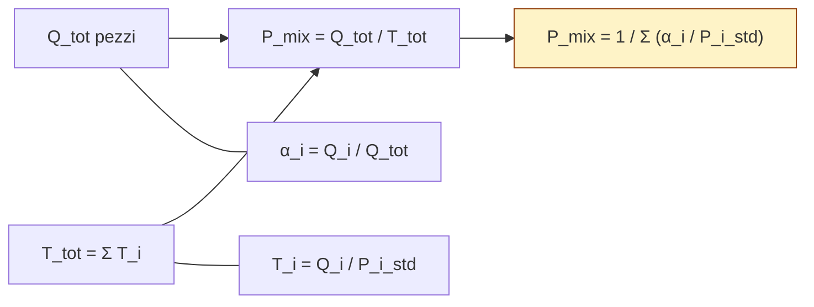

# Potenzialità di mix

> [!summary] In 10 secondi La **Potenzialità di mix** ($P_{mix}$) è la produttività media di una macchina (o linea) che lavora più prodotti diversi. È una **media armonica** dei ritmi standard, pesata sulle quote in volume del mix → "quanti pezzi totali al tempo" sforna la risorsa quando alterna prodotti con ritmi diversi.

## §1 Domanda fondamentale

Quando una sola macchina produce **più prodotti** con ritmi standard differenti → qual è la sua produttività **complessiva** considerando il mix richiesto? Cioè: come "fondi" $n$ ritmi diversi in **un solo numero** che descriva la produttività della risorsa?

## §2 Il problema concreto

Sei l'industrial engineer di uno stabilimento Stellantis a Mirafiori. Una **pressa di stampaggio** da 4M€ (non sostituibile) deve produrre due tipi di pannelli porta:

- **Porta anteriore** (modello A) → ritmo standard $P^{std}_A = 60$ pz/h
- **Porta posteriore** (modello B, più piccola) → ritmo standard $P^{std}_B = 90$ pz/h

Il programma di produzione richiede un mix **50% A + 50% B in volume**.

Il direttore ti chiede:

> "Quanti pannelli totali all'ora riesce a sfornare questa pressa col mix che le abbiamo imposto?"

**Il dilemma**: la tentazione è fare la **media aritmetica** dei ritmi → $(60+90)/2 = 75$ pz/h. Ma è **sbagliato**: la pressa passa **più tempo** a fare il prodotto lento (A) che il veloce (B), perché per produrre lo stesso numero di pezzi A serve più tempo. La media aritmetica sovrastima la realtà.

→ Ti serve una media **pesata sul tempo effettivamente speso**: la $P_{mix}$.

## §3 Definizione

**Definizione formale** (eq. 4 del libro):

$$P_{mix} = \frac{Q_{tot}}{T_{tot}}$$

dove $Q_{tot}$ è la quantità totale prodotta e $T_{tot}$ il tempo totale impiegato per realizzarla.

**Versione completa** (eq. 5, scomposta nei suoi pezzi):

$$P_{mix} = \frac{Q_{conformi} + Q_{nc}}{T_{conformi} + T_{nc} + T_{set\text{-}up}}$$

→ se trascuri scarti ($Q_{nc} \approx 0$) e set-up ($T_{su} \approx 0$), si ottengono le **due formule operative**:

|Forma|Pesi|Quando usarla|
|---|---|---|
|$P_{mix} = \dfrac{1}{\sum_{i=1}^{n} \alpha_i / P^{std}_i}$|$\alpha_i = Q_i/Q_{tot}$ → **% in volume**|Se hai i volumi richiesti $Q_i$|
|$P_{mix} = \sum_{i=1}^{n} \beta_i \cdot P^{std}_i$|$\beta_i = T_i/T_{tot}$ → **% in tempo**|Se hai i tempi assegnati $T_i$|

> [!tip] Memo veloce $\alpha$ = "**quanti pezzi**" (volume) → formula con **reciproco** (media armonica) > $\beta$ = "**quanto tempo**" (tempo) → formula con **prodotto diretto** (media aritmetica)

## §4 Come funziona

**Il cuore in una frase**: la $P_{mix}$ è la media armonica dei ritmi standard, pesata sulle quote in volume → più tempo passi sul prodotto lento, più la $P_{mix}$ scivola verso quel ritmo.

**Diagramma logico** (perché esce una media armonica):

Il punto chiave: $T_i = Q_i / P^{std}_i$ (il tempo per fare $Q_i$ pezzi al ritmo $P^{std}_i$). Quando aggreghi $T_{tot}$ come **somma di tempi** e dividi $Q_{tot}/T_{tot}$, il reciproco finisce inevitabilmente al denominatore → media armonica.

**Cosa accade se...**

> [!example]- Caso limite: un solo prodotto Se il mix degenera ($\alpha_1 = 1$, tutti gli altri $\alpha_i = 0$) → $P_{mix} = P^{std}_1$. Coerente: senza mix, la potenzialità di mix coincide con la potenzialità del prodotto unico. ✅

> [!example]- Caso 50/50 con ritmi diversi Pressa Stellantis: $P^{std}_A = 60$, $P^{std}_B = 90$, mix 50/50. $P_{mix} = \dfrac{1}{0{,}5/60 + 0{,}5/90} = \dfrac{1}{0{,}00833 + 0{,}00556} = 72$ pz/h Mentre la media aritmetica darebbe 75. → $P_{mix}$ è **sempre $\leq$** della media aritmetica.

> [!example]- Variante: cambia il mix Sposti il mix verso il **veloce** (es. 20% A + 80% B) → $P_{mix}$ sale verso 90. Sposti verso il **lento** (80% A + 20% B) → $P_{mix}$ scende verso 60. → $P_{mix}$ è funzione **monotona** della quota del prodotto veloce.

## §5 Applicazione pratica

### Formula operativa (versione "pulita", trascurando scarti e set-up)

$$\boxed{;P_{mix} = \frac{1}{\displaystyle\sum_{i=1}^{n} \dfrac{\alpha_i}{P^{std}_i}};\quad\text{con } \alpha_i = \frac{Q_i}{Q_{tot}};}$$

### Procedura step-by-step

1. **Identifica i prodotti** del mix → $i = 1, 2, \dots, n$
2. **Calcola i ritmi standard** $P^{std}_i$, se non sono dati direttamente:
    - da capacità + tempo unitario: $P^{std}_i = C / t_i$ (es. 200 kg in 20 min → 600 kg/h)
    - da tempo unitario: $P^{std}_i = 1/t_i$
3. **Calcola le quote in volume**: $\alpha_i = Q_i / Q_{tot}$ → verifica $\sum \alpha_i = 1$
4. **Applica la media armonica pesata**: $P_{mix} = 1 / \sum(\alpha_i / P^{std}_i)$
5. **Sanity check**: il risultato deve cadere **tra il più lento e il più veloce** dei ritmi, e tendere al lento se questo ha quota $\alpha$ alta.

### Checklist anti-errore

- [ ] Le quote $\alpha_i$ sommano a 1?
- [ ] Tutti i $P^{std}_i$ sono nella **stessa unità di tempo** (pz/h ↔ pz/min)?
- [ ] Il risultato cade in $[\min P^{std}_i, \max P^{std}_i]$? (Se no → errore di calcolo)
- [ ] Hai accoppiato $\alpha$ con la formula del **reciproco** (e $\beta$ con quella del prodotto diretto)?
- [ ] Se l'esercizio dichiara scarti o set-up → torna alla forma generale, non usare la "pulita"
- [ ] Se serve la **capacità produttiva di mix**: $CP_{mix} = P_{mix} \cdot T_C \cdot OEE$ (vedi §8)

## §6 Esercizio tipo esame

> [!question] **Tappo Pharma S.p.A.** Un'unica linea di compressione produce 3 tipi di compresse:
> 
> |Compressa|Ritmo standard [pz/h]|Quantità mensile [pz]|
> |---|---|---|
> |Antinfiammatorio (A)|4.000|120.000|
> |Vitamina (V)|6.000|80.000|
> |Antistaminico (X)|3.000|40.000|
> 
> Trascurando scarti e set-up, calcola la **potenzialità di mix** della linea.
> 
> **Variante**: e se il mix cambiasse a 50/30/20 (A/V/X)? $P_{mix}$ sale o scende?

### Soluzione passo-passo

**Step 1 — Quantità totale** $Q_{tot} = 120.000 + 80.000 + 40.000 = 240.000$ pz/mese

**Step 2 — Quote in volume**

- $\alpha_A = 120.000 / 240.000 = 0{,}500$ (50%)
- $\alpha_V = 80.000 / 240.000 = 0{,}333$ (33,3%)
- $\alpha_X = 40.000 / 240.000 = 0{,}167$ (16,7%)
- ✅ Verifica: $0{,}500 + 0{,}333 + 0{,}167 = 1$

**Step 3 — Applico la formula**

$$P_{mix} = \frac{1}{\dfrac{0{,}500}{4.000} + \dfrac{0{,}333}{6.000} + \dfrac{0{,}167}{3.000}}$$

Calcolo i tre addendi al denominatore:

- $0{,}500 / 4.000 = 1{,}250 \cdot 10^{-4}$
- $0{,}333 / 6.000 = 0{,}556 \cdot 10^{-4}$
- $0{,}167 / 3.000 = 0{,}556 \cdot 10^{-4}$

Somma: $2{,}361 \cdot 10^{-4}$

$$\boxed{;P_{mix} = \frac{1}{2{,}361 \cdot 10^{-4}} \approx 4.235 \text{ pz/h};}$$

**Step 4 — Sanity check**: $3.000 < 4.235 < 6.000$ ✅ (cade tra il ritmo più lento e il più veloce). È più vicino al lento perché A (lento) ha la quota maggiore.

---

**Variante (mix 50/30/20)**: $$P_{mix}' = \frac{1}{0{,}500/4.000 + 0{,}300/6.000 + 0{,}200/3.000} = \frac{1}{(1{,}250 + 0{,}500 + 0{,}667) \cdot 10^{-4}}$$ $$= \frac{1}{2{,}417 \cdot 10^{-4}} \approx 4.137 \text{ pz/h}$$

→ $P_{mix}$ **scende** (da 4.235 a 4.137) perché ho aumentato la quota del prodotto **più lento** (X: dal 16,7% al 20%) compensando solo in parte con la riduzione di V (veloce, dal 33,3% al 30%).

> [!note] Ragionamento esplicito (la regola d'oro) **Spostare quota verso il prodotto lento → $P_{mix}$ scende.** **Spostare quota verso il veloce → $P_{mix}$ sale.** Questa è la "gravità" del mix: serve sia per controllare la coerenza dei calcoli sia per rispondere a varianti d'esame senza rifare tutto da zero.

## §7 Errori comuni

> [!warning] ❌ Errore #1 — Fare la media aritmetica dei ritmi "Ritmo medio" $= (60 + 90)/2 = 75$ pz/h. **Sbagliato**. $P_{mix}$ è una **media armonica** pesata sulle quote in volume, non aritmetica. Esce sempre **minore** della media aritmetica perché il prodotto lento "occupa più tempo" della macchina rispetto a quanto suggerisca la sua quota in volume → "tira giù" la potenzialità.

> [!warning] ❌ Errore #2 — Confondere $\alpha$ (volume) e $\beta$ (tempo) Le due formule **non sono interscambiabili**:
> 
> - Con $\alpha$ (volume) → formula col **reciproco**: $P_{mix} = 1/\sum(\alpha_i/P^{std}_i)$
> - Con $\beta$ (tempo) → formula col **prodotto diretto**: $P_{mix} = \sum(\beta_i \cdot P^{std}_i)$
> 
> Il testo d'esame ti dice cosa hai: "quantità richieste" → $\alpha$. "Minuti dedicati a ciascun prodotto" → $\beta$. Mescolarle dà numeri assurdi (fuori dall'intervallo $[\min P^{std}, \max P^{std}]$).

> [!warning] ❌ Errore #3 — Dimenticare scarti e set-up quando ci sono La formula "pulita" del §5 vale **solo se trascuri** $T_{scarti}$ e $T_{set\text{-}up}$. Se l'esercizio specifica resa di non conformità o tempo di cambio formato → **devi tornare alla forma generale** $(Q_{cnf}+Q_{nc}) / (T_{cnf}+T_{nc}+T_{su})$. Errore tipico d'esame: applicare la versione semplificata quando il testo dichiara esplicitamente uno scarto del 3% → conta come grave.

## §8 Collegamenti

### Prerequisiti (cosa devi sapere PRIMA)

- [[Potenzialità produttiva]] — la $P_{mix}$ è la generalizzazione di $P$ al caso multiprodotto
- [[Ritmo standard]] — $P^{std}_i$ è l'ingrediente base; $T^{std}_i = 1/P^{std}_i$
- [[Tempi standard di produzione]] — necessari nel calcolo dell'OEE multiprodotto
- [[Efficienza vs Efficacia]] — la $P_{mix}$ è un indicatore di efficienza (output/input temporale)

### Conseguenze (cosa ne consegue)

- [[Capacità produttiva (CP)]] — quando l'impianto è multiprodotto: $CP_{mix} = P_{mix} \cdot T_{OVA} = P_{mix} \cdot T_C \cdot OEE$
- [[OEE]] — nel caso multiprodotto il $T_S$ usato in $E_p$ si calcola come reciproco della $P_{mix}$ (eq. 17 del libro)
- [[Bilanciamento linea multiprodotto]] — il problema combinatorio quando linee con TCL diverse devono produrre più mix
- [[Saturazione e coefficiente di utilizzazione]] — $P_{mix}$ è il "denominatore" quando calcoli quanto è satura una linea multiprodotto

### Vedi anche

- §3.2.3 di `Impianti_2026.pdf` — derivazione completa eq. (4)→(10)
- **Esempio Gragnano S.r.l.** (§3.2.5 del libro) → integra $P_{mix}$ + OEE + $CP$ in un esercizio unico
- [[VRP - Variety Reduction Program]] — riducendo la varietà del mix si semplifica il calcolo di $P_{mix}$ e si riducono le perdite di tempo (set-up)
- [[CODP - Customer Order Decoupling Point|CODP]] — più si è verso ETO, più mix variabile → $P_{mix}$ è meno stabile come parametro di dimensionamento

## §9 Auto-verifica

1. **Richiamo**: scrivi a memoria, senza guardare, le **due** forme della $P_{mix}$ — quella con i pesi $\alpha$ in volume e quella con i pesi $\beta$ in tempo. Quale ha il reciproco?
    
2. **Ragionamento**: una linea produce A (60 pz/h) e B (120 pz/h) al 50/50 in volume. La $P_{mix}$ risultante è più vicina a 60 o a 120? Perché? _(Hint: ricorda la "regola d'oro" del §6.)_
    
3. **Profondità concettuale**: perché la $P_{mix}$ con i pesi $\alpha$ (volume) dà una **media armonica**, mentre con i pesi $\beta$ (tempo) dà una **media aritmetica**? Cosa stai aggregando linearmente nei due casi — pezzi o tempi?