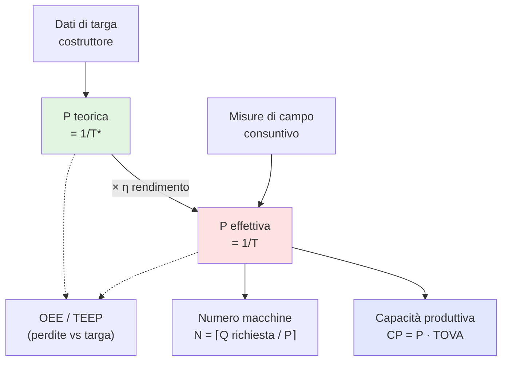

Produttività di un fattore produttivo
$$
\text{produttività }(f) = \frac{\text{Output}}{\text{Input}}
$$
## manodopera

## macchinari

## materiali

---

tags: [impianti, cap3, prestazioni, quantitativo] tipo: atomic-note capitolo: "[[03 Cap3 - Prestazioni dei sistemi di produzione]]"

# Produttività

> [!tldr] In 10 secondi La **produttività** P = Q/T è il **ritmo a cui un sistema sforna prodotti**. È il "tachimetro" dell'impianto: dice quanti pezzi escono per unità di tempo, ed è la base per dimensionare capacità, linee e macchine.

---

## §1 Domanda fondamentale

> Quanto velocemente, in regime ideale o reale, un sistema produttivo è in grado di trasformare input in output?

---

## §2 Il problema concreto

**L'Oréal Italia**, stabilimento di Settimo Torinese, linea automatica di **riempimento mascara**.

Sul catalogo del costruttore, la linea ha un **dato di targa**: 1.200 tubetti/ora. A consuntivo del mese scorso, il responsabile di produzione tira le somme:

- ore di lavoro effettive sulla linea: **160 h**
- tubetti conformi usciti: **136.000**

Numeri alla mano: 136.000 / 160 = **850 tubetti/ora**.

Arriva un ordine: **200.000 tubetti in un mese** (le 160 h disponibili). Il commerciale apre la scheda tecnica della linea, vede "1.200 pz/h", e risponde al cliente: «Ce la facciamo: 1.200 × 160 = 192.000… anzi, il prossimo mese ne possiamo fare anche di più».

→ **Il dilemma**: quale produttività ha citato il commerciale? E perché probabilmente l'ordine **non è fattibile**? Cosa distingue il "1.200" sulla brochure dall'"850" che la linea ha davvero retto sul campo? Se confondiamo le due, **promettiamo al cliente quello che l'impianto non sa fare**.

---

## §3 La definizione

**Produttività** (P), detta anche **potenzialità produttiva**, **ritmo produttivo standard**, **tasso di attraversamento** (en. _throughput rate_, _throughput_):

$$P = \frac{Q}{T} \quad \left[\frac{\text{volume prodotto}}{\text{tempo}}\right]$$

È una **prestazione interna** (il cliente non la "vede" direttamente, ma la subisce nei tempi di consegna). Misura aggregata, ha senso su intervalli **medio-lunghi**: si trascurano le variazioni di breve periodo.

### Scomposizione in due forme

|Tipo|Significato|Origine del dato|
|---|---|---|
|**Potenzialità teorica** (massima)|Velocità raggiungibile in condizioni ideali|**Dati di targa** del costruttore|
|**Potenzialità effettiva**|Ritmo realmente mantenuto su un periodo|**Misurato** sul campo a consuntivo|

Legate dal **rendimento di produzione**: $$\eta = \frac{T^*}{T} = \frac{P_{\text{eff}}}{P_{\text{teor}}} < 1$$ dove T* = tempo teorico per pezzo, T = tempo medio reale per pezzo.

### Per fattore produttivo (i fattori sono disomogenei → P si scompone)

- **Produttività del lavoro** = volume prodotto / ore di lavoro (umano)
- **Produttività dei macchinari** = volume prodotto / ore macchina
- **Produttività dei materiali** (anche detta **resa**) = volume prodotto / quantità materie prime

---

## §4 Come funziona

> **Cuore**: la produttività è il rapporto fra ciò che **esce** e il **tempo** necessario per farlo uscire — più sale, più velocemente l'impianto consegna valore.

### Diagramma logico

### Cosa accade se…

- **Linea di N macchine in serie** → la P della linea **non è la somma** né la media: è quella del **collo di bottiglia** (la macchina più lenta detta il ritmo, le altre attendono o si bloccano).
- **Più prodotti sulla stessa linea** (mix) → si calcola la **[[Potenzialità di mix]]** Pmix, media pesata sui volumi αi = Qi/Qtot.
- **η peggiora** (manutenzione carente, operatori meno esperti) → P effettiva crolla anche se P teorica resta uguale → CP reale < CP installata.
- **Nuova linea senza storico** → si stima η da impianti simili (tipico per primo dimensionamento).

---

## §5 Applicazione pratica

### Formula

$$\boxed{P = \frac{Q}{T}}$$

Per una macchina con **rendimento η**: $$P_{\text{eff}} = \eta \cdot P_{\text{teor}} = \frac{\eta}{T^*}$$

Per una **linea**: $$P_{\text{linea}} = P_{\text{collo di bottiglia}}$$

### Passo-passo per calcolarla

1. **Decidi quale P serve**: teorica (per benchmark, per stimare OEE) o effettiva (per dimensionamento e promesse al cliente)?
2. **Definisci l'unità di misura** dell'output (pezzi, kg, litri…) e il **tempo di riferimento** (h, mese, anno).
3. **Raccogli i dati**:
    - per P **teorica** → scheda tecnica della macchina (1/T*)
    - per P **effettiva** → tabulati di produzione: Q realizzata / T impiegato
4. **Verifica omogeneità unità**: pezzi/ora ≠ pezzi/turno se non converti.
5. **Se più macchine in serie** → identifica il collo di bottiglia (la P **minima**) e usa quella.
6. **Se più prodotti** → passa a Pmix con i pesi αi in volume oppure βi in tempo.
7. **Sanity check**: P_eff ≤ P_teor sempre. Se trovi P_eff > P_teor hai sbagliato una misura.

### Checklist anti-errore

- [ ] Sto usando la P **giusta** (teorica vs effettiva) per il problema che ho davanti?
- [ ] Le unità di Q e T sono coerenti?
- [ ] Per una linea, ho preso il collo di bottiglia, non la media?
- [ ] Per più prodotti, ho applicato Pmix e non un singolo Pi?
- [ ] η è stato calcolato come T*/T (≤1) e non al contrario?

---

## §6 Esercizio tipo esame

> **L'Oréal Settimo Torinese** ha una linea di riempimento mascara. Dati:
> 
> - dato di targa: **1.200 tubetti/h**
> - mese scorso: 160 h lavorate, **136.000 tubetti conformi** prodotti
> 
> **a)** Calcola P teorica, P effettiva e il rendimento η della linea. **b)** Il commerciale ha promesso a un cliente **200.000 tubetti** nelle prossime 160 h disponibili. La promessa è realistica? **c)** Quanti tubetti si potrebbero davvero produrre nel periodo?

### Soluzione passo-passo

**a)** Calcolo le due produttività: $$P_{\text{teor}} = 1.200 , \text{tubetti/h}$$ $$P_{\text{eff}} = \frac{Q}{T} = \frac{136.000}{160} = 850 , \text{tubetti/h}$$ $$\eta = \frac{P_{\text{eff}}}{P_{\text{teor}}} = \frac{850}{1.200} \approx 0{,}71 $$

> **Ragionamento**: η = 71% significa che la linea, nella realtà, lavora a circa il 71% del suo dato di targa. Il restante 29% è "mangiato" da fermate, microstop, rallentamenti, set-up, scarti — tutta roba che l'OEE poi disaggrega.

**b)** Capacità realmente erogabile: $$\text{CP}_{\text{reale}} = P_{\text{eff}} \cdot T = 850 \cdot 160 = 136.000 , \text{tubetti}$$ $$\text{CP}_{\text{teorica}} = P_{\text{teor}} \cdot T = 1.200 \cdot 160 = 192.000 , \text{tubetti}
$$

→ La promessa di **200.000** è irrealistica anche con la P teorica (192k < 200k); con quella **effettiva** scende drasticamente a **136.000**. Mancano **64.000 tubetti** all'appello.

> **Errore del commerciale**: ha letto il dato di targa, non il consuntivo storico. Ha confuso _capacità installata_ con _capacità erogabile_.

**c)** ~136.000 tubetti, salvo interventi (turni straordinari, incremento η).

### Variante — "e se cambiasse X?"

> _E se L'Oréal lanciasse un piano TPM che porta η al 85%?_

$$P_{\text{eff,nuovo}} = 0{,}85 \cdot 1.200 = 1.020 , \text{tubetti/h}$$ $$\text{CP}_{\text{nuova}} = 1.020 \cdot 160 = 163.200 , \text{tubetti}$$

Avvicina ma non raggiunge le 200k. Servirebbero **anche** ore extra, oppure un secondo turno: con 200 h e η=85% si arriverebbe a 204.000 → ordine fattibile.

> **Lezione**: le leve sulla produttività effettiva sono **due** — agire su η (manutenzione, formazione, riduzione setup) o sul tempo disponibile T (turni, calendario). Sul P teorico si interviene solo cambiando macchina.

---

## §7 Errori comuni

> [!warning] ❌ Errore 1: confondere P teorica e P effettiva Usare il dato di targa (1.200 pz/h) per dimensionare la capacità reale o promettere consegne. **Perché**: il dato di targa ignora fermate, set-up, microstop, scarti — tutto ciò che OEE/TEEP poi quantifica. **Come evitarlo**: nei calcoli di **dimensionamento e promesse al cliente** usa sempre P effettiva (o P teorica × OEE atteso). Il dato di targa serve solo per il benchmark contro cui misurarsi.

> [!warning] ❌ Errore 2: sommare le P delle macchine in serie Vedi una linea con 5 macchine da 100, 80, 60, 90, 100 pz/h e calcoli P_linea = 100+80+60+90+100 = 430. **Perché**: in serie il flusso è **vincolato dalla macchina più lenta**: a valle nessuno può andare più veloce di chi sta a monte (e viceversa, a monte ci si blocca per saturazione del buffer). Le P **non si sommano**, dominano. **Come evitarlo**: P_linea = min(Pj) = P del **[[Collo di bottiglia]]**. Le P si sommano solo per macchine in **parallelo** che fanno la stessa operazione.

> [!warning] ❌ Errore 3: ignorare il mix produttivo Linea che fa 3 prodotti con ritmi standard diversi. Calcoli P media = (P₁+P₂+P₃)/3. **Perché**: ogni prodotto pesa diversamente sul volume totale; la media aritmetica semplice ignora i pesi αi. **Come evitarlo**: usa **[[Potenzialità di mix]]**: Pmix = 1 / Σ(αi/Pi) con αi = Qi/Qtot.

---

## §8 Collegamenti

### Prerequisiti (cosa devi sapere PRIMA)

- [[Sistema di produzione]] — il "soggetto" di cui misuriamo la P
- [[Ciclo di lavorazione]] — definisce T* (tempo teorico per pezzo)
- [[Tempo di attraversamento]] — distinzione tra TA della singola stazione e TCL della linea
- [[Volume prodotto]] vs Q conformi/scarti/rilavorazioni

### Conseguenze (cosa ne discende DOPO)

- [[Capacità Produttiva]] — CP = P · TOVA: la P è il fattore di scala
- [[Potenzialità di mix]] — generalizzazione di P per più prodotti
- [[Collo di bottiglia]] — determina P della linea
- [[Rendimento di produzione]] — η lega P teorica a P effettiva
- [[OEE]] e [[TEEP]] — disaggregano le perdite che spostano P_teor → P_eff
- [[Numero di macchine necessarie]] — N = ⌈Q richiesta / P⌉ (Cap 5)
- [[Bilanciamento di linea]] — TCL = 1/P della linea (Cap 5)

### Trade-off / connessioni trasversali

- **Capacità teorica ↔ capacità reale**: il gap è esattamente η, e η si scompone in OEE.
- **P alta + flessibilità bassa** vs **P bassa + flessibilità alta** → riemerge nella scelta job_shop vs flow_shop (Cap 2 e Cap 6).

---

## §9 Auto-verifica

1. Qual è la formula della produttività e in quali unità di misura si esprime?
2. Qual è la differenza tra potenzialità **teorica** ed **effettiva**, e come si chiama il loro rapporto? In quale ordine si dispongono numericamente?
3. In una linea di 5 macchine in serie con ritmi diversi, perché la produttività della linea **non** è la media (né la somma) dei ritmi delle singole macchine? Qual è la regola corretta, e perché — fisicamente — funziona così?

